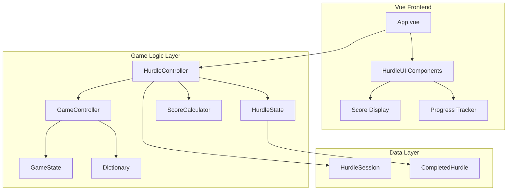

# Design Document: Hurdle Mode

## Overview

Hurdle Mode transforms the existing single-word Wordle-style game into an endless chain of word puzzles with a sophisticated scoring system. The design extends the current GameController and GameState architecture to support continuous gameplay, automatic progression between puzzles, and comprehensive score tracking. The implementation maintains clean separation of concerns while integrating seamlessly with the existing Vue.js frontend and game mechanics.

## Architecture

### High-Level Architecture



### Component Responsibilities

- **HurdleController**: Orchestrates the hurdle chain, manages transitions, and coordinates scoring
- **HurdleState**: Tracks overall hurdle session state (current hurdle number, completed hurdles, total score)
- **ScoreCalculator**: Implements the scoring formula and multiplier logic
- **HurdleSession**: Data model representing a complete hurdle mode session
- **CompletedHurdle**: Data model for individual completed hurdles with scoring information

## Components and Interfaces

### HurdleController Class

```javascript
class HurdleController {
  constructor(dictionary)
  async startHurdleMode(): Promise<HurdleSession>
  async processHurdleCompletion(gameState: GameState): Promise<HurdleTransition>
  async startNextHurdle(previousAnswer: string): Promise<GameState>
  getHurdleState(): HurdleState
  calculateFinalScore(): number
  endHurdleMode(): HurdleSession
}
```

**Key Methods:**
- `startHurdleMode()`: Initializes a new hurdle session with Hurdle 1
- `processHurdleCompletion()`: Handles successful hurdle completion, calculates points, and prepares transition
- `startNextHurdle()`: Creates new GameState with auto-guess and different target word
- `endHurdleMode()`: Finalizes session and returns complete results

### HurdleState Class

```javascript
class HurdleState {
  constructor()
  getCurrentHurdleNumber(): number
  getCompletedHurdlesCount(): number
  getTotalScore(): number
  addCompletedHurdle(hurdle: CompletedHurdle): void
  incrementHurdleNumber(): void
  reset(): void
}
```

**State Tracking:**
- Current hurdle number (starts at 1)
- Count of completed hurdles
- Running total score
- List of completed hurdles with individual scores

### ScoreCalculator Class

```javascript
class ScoreCalculator {
  static calculateHurdleScore(hurdleNumber: number, guessCount: number): number
  static getGuessMultiplier(guessCount: number): number
  static calculateFinalScore(completedHurdles: CompletedHurdle[]): number
}
```

**Scoring Formula Implementation:**
- Base formula: `hurdleNumber × 100 × guessMultiplier`
- Guess multipliers: 1 guess = 1.75x, 2 guesses = 1.5x, 3 guesses = 1.25x, 4 guesses = 1.0x
- Final score: Sum of all completed hurdle scores

### HurdleTransition Interface

```javascript
interface HurdleTransition {
  completedHurdle: CompletedHurdle
  nextHurdleNumber: number
  shouldContinue: boolean
  animationData: {
    clearBoard: boolean
    autoGuess: string
    showScore: number
  }
}
```

## Data Models

### HurdleSession Model

```javascript
class HurdleSession {
  constructor() {
    this.sessionId = generateUniqueId()
    this.startTime = new Date()
    this.endTime = null
    this.currentHurdleNumber = 1
    this.completedHurdles = []
    this.totalScore = 0
    this.endReason = null // 'failure' | 'manual-stop'
    this.finalHurdleAnswer = null
  }
}
```

### CompletedHurdle Model

```javascript
class CompletedHurdle {
  constructor(hurdleNumber, targetWord, guessCount, score, guesses) {
    this.hurdleNumber = hurdleNumber
    this.targetWord = targetWord
    this.guessCount = guessCount
    this.score = score
    this.guesses = guesses // Array of Guess objects
    this.completedAt = new Date()
    this.guessMultiplier = ScoreCalculator.getGuessMultiplier(guessCount)
  }
}
```

## Integration with Existing Architecture

### GameController Extension

The existing GameController remains unchanged. HurdleController wraps GameController instances:

```javascript
class HurdleController {
  constructor(dictionary) {
    this.dictionary = dictionary
    this.currentGameController = null
    this.hurdleState = new HurdleState()
    this.session = null
  }
  
  async startNextHurdle(autoGuess = null) {
    this.currentGameController = new GameController(this.dictionary)
    const gameState = await this.currentGameController.startNewGame()
    
    if (autoGuess) {
      // Submit auto-guess immediately
      await this.currentGameController.submitGuess(autoGuess)
    }
    
    return gameState
  }
}
```

### Vue.js Frontend Integration

App.vue will be extended with hurdle mode detection and UI components:

```javascript
// In App.vue setup()
const hurdleController = ref(null)
const isHurdleMode = ref(false)
const hurdleState = ref(null)

const startHurdleMode = async () => {
  hurdleController.value = new HurdleController(dictionary)
  const session = await hurdleController.value.startHurdleMode()
  isHurdleMode.value = true
  hurdleState.value = hurdleController.value.getHurdleState()
}
```

### Word Selection Strategy

To ensure different words between hurdles:

```javascript
class HurdleController {
  async selectNextWord(previousWord) {
    let attempts = 0
    let newWord
    
    do {
      newWord = await this.dictionary.getRandomWord()
      attempts++
    } while (newWord === previousWord && attempts < 10)
    
    if (newWord === previousWord) {
      // Fallback: use word list to find different word
      newWord = await this.findDifferentWord(previousWord)
    }
    
    return newWord
  }
}
```

## Correctness Properties

*A property is a characteristic or behavior that should hold true across all valid executions of a system—essentially, a formal statement about what the system should do. Properties serve as the bridge between human-readable specifications and machine-verifiable correctness guarantees.*

### Property Reflection

After analyzing all acceptance criteria, several properties can be consolidated to eliminate redundancy:

- Properties 2.2 and 6.5 both test word uniqueness between consecutive hurdles - these can be combined
- Properties 1.4, 7.1, and 7.2 all test UI display requirements - these can be combined into comprehensive UI testing
- Properties 3.1-3.5 all test the transition animation sequence - these can be combined into a comprehensive transition property
- Properties 5.1-5.3 all test scoring calculation - these can be combined into comprehensive scoring validation

### Core Properties

**Property 1: Hurdle Mode Initialization**
*For any* hurdle mode start, the system should initialize with hurdle number 1, completed hurdles count 0, total score 0, exactly 4 attempts available, and a valid 5-letter target word
**Validates: Requirements 1.1, 1.2, 1.3, 1.5**

**Property 2: Hurdle Progression and Word Uniqueness**
*For any* successful hurdle completion, the system should immediately start a new hurdle with the previous answer as auto-guess, increment hurdle number by 1, increment completed hurdles count by 1, and ensure the new target word is different from the previous answer
**Validates: Requirements 2.1, 2.2, 2.3, 2.5, 2.6, 6.5**

**Property 3: Auto-guess Counting**
*For any* hurdle transition with auto-guess, the auto-guess should count as Guess #1 for the new hurdle and leave exactly 3 remaining attempts
**Validates: Requirements 2.4**

**Property 4: Comprehensive UI Display**
*For any* active hurdle mode session, the UI should display the current hurdle number, total completed hurdles count, and current cumulative score prominently
**Validates: Requirements 1.4, 7.1, 7.2, 7.4**

**Property 5: Transition Animation Sequence**
*For any* hurdle completion, the system should execute the complete animation sequence: clear board with tile flipping, enter auto-guess with tile flipping, display feedback, update hurdle number, and be ready for next guess
**Validates: Requirements 3.1, 3.2, 3.3, 3.4, 3.5**

**Property 6: Game Failure Handling**
*For any* hurdle where 4 attempts are used without success, the system should immediately end the game, display the correct answer, calculate final score, and provide restart option
**Validates: Requirements 4.1, 4.2, 4.3, 4.4, 4.5**

**Property 7: Comprehensive Scoring Calculation**
*For any* completed hurdle, the system should calculate points using the formula (hurdle_number × 100 × guess_multiplier) where multipliers are 1.75x for 1 guess, 1.5x for 2 guesses, 1.25x for 3 guesses, and 1.0x for 4 guesses
**Validates: Requirements 5.1, 5.2, 5.3**

**Property 8: Final Score Calculation**
*For any* game ending, the final score should equal the sum of all individual hurdle scores, and display both individual hurdle points and cumulative total
**Validates: Requirements 5.4, 5.6**

**Property 9: Score Display on Completion**
*For any* hurdle completion, the system should display the points earned for that specific hurdle
**Validates: Requirements 7.3**

**Property 10: Game End Summary**
*For any* game ending, the system should display a summary showing completed hurdles count and final score
**Validates: Requirements 7.5**

**Property 11: Word Definition Management**
*For any* completed hurdle, the system should add the word to the solved words list, provide option to view its definition, and maintain access to all completed word definitions throughout the session
**Validates: Requirements 8.1, 8.2, 8.3, 8.5**

**Property 12: Definition Display Format**
*For any* word definition display, the system should show the word alongside its definition
**Validates: Requirements 8.4**

**Property 13: Restart State Reset**
*For any* hurdle mode restart, the system should reset hurdle count to 1, completed hurdles to 0, score to 0, and clear all previous game state
**Validates: Requirements 6.4**

### Edge Case Examples

**Example 1: Zero Hurdles Completed**
When zero hurdles are completed, the final score should be 0
**Validates: Requirements 5.5**

**Example 2: Auto-guess Immediate Win**
When the auto-guess immediately solves the new hurdle, the system should award points as a 1-guess completion and continue to the next hurdle
**Validates: Requirements 6.1, 6.2**

<function_calls>
<invoke name="prework">
<parameter name="featureName">hurdle-mode

## Error Handling

### Word Selection Failures

**Duplicate Word Prevention:**
- Implement retry logic with maximum 10 attempts to find different word
- Fallback to word list filtering if random selection fails
- Graceful degradation to any valid word if all else fails

**Dictionary Exhaustion:**
- Detect when word selection consistently fails
- Implement circular word list with tracking to prevent immediate repeats
- Log warnings but continue gameplay with available words

### State Corruption Recovery

**Invalid State Detection:**
- Validate hurdle numbers are sequential and positive
- Ensure completed hurdles count matches actual completed hurdles array
- Verify score calculations match sum of individual hurdle scores

**Recovery Strategies:**
- Reset to last known good state if corruption detected
- Recalculate scores from completed hurdles array
- Reinitialize session if state is unrecoverable

### Animation and UI Failures

**Animation Timeout Handling:**
- Set maximum animation duration timeouts
- Continue gameplay if animations fail to complete
- Provide fallback immediate state updates

**UI State Synchronization:**
- Implement reactive state updates to prevent UI desync
- Force UI refresh after critical state changes
- Validate UI displays match internal state

## Testing Strategy

### Dual Testing Approach

The testing strategy employs both unit tests and property-based tests to ensure comprehensive coverage:

**Unit Tests:**
- Specific examples demonstrating correct behavior
- Edge cases and error conditions
- Integration points between components
- Animation timing and UI state transitions

**Property-Based Tests:**
- Universal properties across all inputs using fast-check library
- Minimum 100 iterations per property test
- Comprehensive input coverage through randomization
- Each property test references its design document property

### Property-Based Testing Configuration

**Library:** fast-check (JavaScript property-based testing library)
**Test Configuration:**
- Minimum 100 iterations per property test
- Custom generators for game states, hurdle numbers, and word lists
- Shrinking enabled to find minimal failing examples

**Test Tagging Format:**
Each property test must include a comment with the format:
```javascript
// Feature: hurdle-mode, Property 1: Hurdle Mode Initialization
```

### Unit Testing Focus Areas

**Scoring System:**
- Test specific scoring calculations with known inputs
- Verify multiplier application for each guess count
- Test edge cases like zero hurdles and maximum hurdle numbers

**State Transitions:**
- Test hurdle completion workflows
- Verify auto-guess integration
- Test game ending scenarios

**UI Integration:**
- Test Vue component reactivity
- Verify animation triggers
- Test user interaction handling

**Error Conditions:**
- Test word selection failures
- Test invalid state recovery
- Test API failures and fallbacks

### Integration Testing

**End-to-End Scenarios:**
- Complete hurdle mode sessions from start to finish
- Multi-hurdle progression with scoring validation
- Game ending and restart workflows

**Component Integration:**
- HurdleController with GameController interaction
- Vue.js frontend with hurdle logic integration
- Dictionary integration with word selection

### Performance Testing

**Memory Management:**
- Test for memory leaks in long hurdle sessions
- Verify completed hurdles array doesn't grow unbounded
- Test cleanup on session restart

**Animation Performance:**
- Verify smooth transitions between hurdles
- Test animation performance with rapid hurdle completions
- Validate UI responsiveness during transitions

The comprehensive testing strategy ensures both functional correctness through property-based testing and practical usability through targeted unit and integration tests.