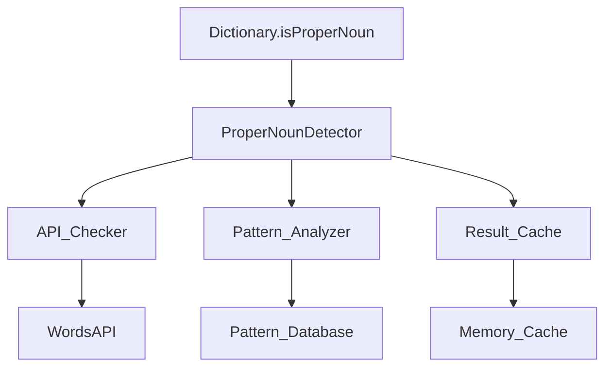

# Design Document: Enhanced Proper Noun Detection

## Overview

This design implements a hybrid proper noun detection system that combines WordsAPI linguistic data with intelligent pattern analysis to accurately exclude proper nouns from the Hurdle word game. The system prioritizes accuracy while maintaining performance through caching and graceful fallback mechanisms.

## Architecture

The enhanced proper noun detection system follows a layered architecture:



### Detection Flow

1. **Cache Check**: First check if result is already cached
2. **API Detection**: Query WordsAPI for parts of speech if available
3. **Pattern Analysis**: Use linguistic patterns as primary or fallback method
4. **Result Combination**: Combine results using conservative logic
5. **Cache Storage**: Store result for future use

## Components and Interfaces

### ProperNounDetector Class

Main orchestrator that coordinates detection methods:

```javascript
class ProperNounDetector {
  constructor(apiChecker, patternAnalyzer, cache) {
    this.apiChecker = apiChecker;
    this.patternAnalyzer = patternAnalyzer;
    this.cache = cache;
    this.metrics = new DetectionMetrics();
  }

  async isProperNoun(word) {
    // Check cache first
    const cached = this.cache.get(word);
    if (cached !== null) return cached.result;

    // Try API detection first
    const apiResult = await this.apiChecker.checkProperNoun(word);
    
    // Always run pattern analysis (for comparison and fallback)
    const patternResult = this.patternAnalyzer.isProperNoun(word);

    // Combine results with conservative logic
    const finalResult = this.combineResults(apiResult, patternResult);
    
    // Cache and return result
    this.cache.set(word, finalResult, apiResult !== null);
    this.metrics.recordDetection(word, finalResult, apiResult !== null);
    
    return finalResult;
  }

  combineResults(apiResult, patternResult) {
    // If API says it's a proper noun, trust it
    if (apiResult === true) return true;
    
    // If API says it's not a proper noun, but pattern says it is, be conservative
    if (apiResult === false && patternResult === true) {
      // Log disagreement for analysis
      console.log(`Detection disagreement for word - API: false, Pattern: true`);
      return true; // Err on side of exclusion
    }
    
    // If API unavailable, use pattern result
    if (apiResult === null) return patternResult;
    
    // Default case: API says not proper noun, pattern agrees or is inconclusive
    return false;
  }
}
```

### APIChecker Class

Handles WordsAPI integration with timeout and error handling:

```javascript
class APIChecker {
  constructor(apiKey, timeout = 2000) {
    this.apiKey = apiKey;
    this.timeout = timeout;
    this.requestCount = 0;
    this.rateLimitExceeded = false;
  }

  async checkProperNoun(word) {
    if (this.rateLimitExceeded) return null;

    try {
      const controller = new AbortController();
      const timeoutId = setTimeout(() => controller.abort(), this.timeout);

      const response = await fetch(
        `https://wordsapiv1.p.rapidapi.com/words/${word.toLowerCase()}`,
        {
          method: 'GET',
          headers: {
            'X-RapidAPI-Key': this.apiKey,
            'X-RapidAPI-Host': 'wordsapiv1.p.rapidapi.com'
          },
          signal: controller.signal
        }
      );

      clearTimeout(timeoutId);
      this.requestCount++;

      if (response.status === 403 || response.status === 429) {
        this.rateLimitExceeded = true;
        return null;
      }

      if (!response.ok) return null;

      const data = await response.json();
      return this.parsePartsOfSpeech(data);
      
    } catch (error) {
      if (error.name === 'AbortError') {
        console.log(`API timeout for word: ${word}`);
      }
      return null;
    }
  }

  parsePartsOfSpeech(data) {
    if (!data.results || !Array.isArray(data.results)) return false;
    
    return data.results.some(result => {
      const partOfSpeech = result.partOfSpeech?.toLowerCase();
      return partOfSpeech === 'proper noun' || 
             partOfSpeech === 'noun, proper' ||
             partOfSpeech === 'proper_noun';
    });
  }
}
```

### PatternAnalyzer Class

Implements linguistic pattern matching:

```javascript
class PatternAnalyzer {
  constructor() {
    this.patterns = new PatternDatabase();
  }

  isProperNoun(word) {
    const normalizedWord = word.toLowerCase();
    
    // Check against known proper noun lists
    if (this.patterns.isKnownProperNoun(normalizedWord)) return true;
    
    // Check suffix patterns
    if (this.patterns.hasProperNounSuffix(normalizedWord)) return true;
    
    // Check prefix patterns  
    if (this.patterns.hasProperNounPrefix(word)) return true; // Keep original case for prefixes
    
    // Check if it's a common first name
    if (this.patterns.isCommonFirstName(normalizedWord)) return true;
    
    // Check if it's a place name
    if (this.patterns.isPlaceName(normalizedWord)) return true;
    
    // Check if it's a brand name
    if (this.patterns.isBrandName(normalizedWord)) return true;
    
    return false;
  }
}
```

### PatternDatabase Class

Maintains pattern data and matching logic:

```javascript
class PatternDatabase {
  constructor() {
    this.suffixes = ['-son', '-berg', '-stein', '-ton', '-ford', '-burg', '-land', '-wood', '-ville', '-shire'];
    this.prefixes = ['mc', 'mac', "o'", 'de', 'van', 'von', 'la', 'le', 'el'];
    
    this.firstNames = new Set([
      'james', 'mary', 'john', 'patricia', 'robert', 'jennifer', 'michael', 'linda',
      'david', 'elizabeth', 'william', 'barbara', 'richard', 'susan', 'joseph', 'jessica',
      'thomas', 'sarah', 'christopher', 'karen', 'charles', 'nancy', 'daniel', 'lisa',
      'matthew', 'betty', 'anthony', 'helen', 'mark', 'sandra', 'donald', 'donna',
      'steven', 'carol', 'paul', 'ruth', 'andrew', 'sharon', 'joshua', 'michelle',
      'kenneth', 'laura', 'kevin', 'sarah', 'brian', 'kimberly', 'george', 'deborah',
      'edward', 'dorothy', 'ronald', 'lisa', 'timothy', 'nancy', 'jason', 'karen',
      'jeffrey', 'betty', 'ryan', 'helen', 'jacob', 'sandra', 'gary', 'donna',
      'nicholas', 'carol', 'eric', 'ruth', 'jonathan', 'sharon', 'stephen', 'michelle',
      'larry', 'laura', 'justin', 'sarah', 'scott', 'kimberly', 'brandon', 'deborah',
      'benjamin', 'dorothy', 'samuel', 'lisa', 'gregory', 'nancy', 'alexander', 'karen',
      'frank', 'betty', 'raymond', 'helen', 'jack', 'sandra', 'dennis', 'donna',
      'jerry', 'carol', 'tyler', 'ruth', 'aaron', 'sharon', 'henry', 'michelle',
      'douglas', 'laura', 'peter', 'sarah', 'noah', 'kimberly', 'arthur', 'deborah'
    ]);
    
    this.placeNames = new Set([
      'paris', 'london', 'tokyo', 'china', 'japan', 'texas', 'florida', 'spain',
      'italy', 'france', 'russia', 'brazil', 'india', 'egypt', 'greece', 'peru',
      'chile', 'kenya', 'ghana', 'libya', 'syria', 'iraq', 'iran', 'cuba',
      'haiti', 'nepal', 'tibet', 'wales', 'malta', 'cyprus', 'samoa', 'tonga',
      'fiji', 'palau', 'nauru', 'malta', 'monaco', 'andorra', 'liechtenstein',
      'luxembourg', 'iceland', 'ireland', 'poland', 'czech', 'slovak', 'hungary',
      'romania', 'bulgaria', 'serbia', 'bosnia', 'croatia', 'slovenia', 'albania'
    ]);
    
    this.brandNames = new Set([
      'apple', 'google', 'microsoft', 'amazon', 'facebook', 'tesla', 'nike', 'adidas',
      'coca', 'pepsi', 'honda', 'toyota', 'ford', 'bmw', 'audi', 'mercedes',
      'samsung', 'sony', 'canon', 'nikon', 'adobe', 'oracle', 'cisco', 'intel',
      'nvidia', 'qualcomm', 'broadcom', 'texas', 'analog', 'maxim'
    ]);
  }

  isKnownProperNoun(word) {
    return this.firstNames.has(word) || 
           this.placeNames.has(word) || 
           this.brandNames.has(word);
  }

  hasProperNounSuffix(word) {
    return this.suffixes.some(suffix => word.endsWith(suffix.substring(1)));
  }

  hasProperNounPrefix(word) {
    const lowerWord = word.toLowerCase();
    return this.prefixes.some(prefix => lowerWord.startsWith(prefix));
  }

  isCommonFirstName(word) {
    return this.firstNames.has(word);
  }

  isPlaceName(word) {
    return this.placeNames.has(word);
  }

  isBrandName(word) {
    return this.brandNames.has(word);
  }
}
```

## Data Models

### DetectionResult

```javascript
class DetectionResult {
  constructor(word, isProperNoun, method, confidence, timestamp) {
    this.word = word;
    this.isProperNoun = isProperNoun;
    this.method = method; // 'api', 'pattern', 'hybrid'
    this.confidence = confidence; // 0.0 to 1.0
    this.timestamp = timestamp;
  }
}
```

### DetectionCache

```javascript
class DetectionCache {
  constructor(maxSize = 1000, ttl = 24 * 60 * 60 * 1000) { // 24 hours
    this.cache = new Map();
    this.maxSize = maxSize;
    this.ttl = ttl;
  }

  get(word) {
    const entry = this.cache.get(word.toLowerCase());
    if (!entry) return null;
    
    if (Date.now() - entry.timestamp > this.ttl) {
      this.cache.delete(word.toLowerCase());
      return null;
    }
    
    return entry;
  }

  set(word, result, fromAPI) {
    if (this.cache.size >= this.maxSize) {
      // Remove oldest entry
      const firstKey = this.cache.keys().next().value;
      this.cache.delete(firstKey);
    }
    
    this.cache.set(word.toLowerCase(), {
      result,
      fromAPI,
      timestamp: Date.now()
    });
  }
}
```

## Correctness Properties

*A property is a characteristic or behavior that should hold true across all valid executions of a system-essentially, a formal statement about what the system should do. Properties serve as the bridge between human-readable specifications and machine-verifiable correctness guarantees.*

<function_calls>
<invoke name="prework">
<parameter name="featureName">proper-noun-detection

### Property Reflection

After reviewing all properties identified in the prework analysis, I've identified several areas where properties can be consolidated:

**Redundancy Analysis:**
- Properties 2.1-2.5 (pattern matching for different types) can be combined into a comprehensive pattern recognition property
- Properties 3.4 and 3.5 (logging and metrics) can be combined into a single monitoring property  
- Properties 4.1 and 1.5 (caching behavior) overlap and can be unified
- Properties 6.4 and 6.5 (error handling and monitoring) can be consolidated

**Consolidated Properties:**
- Combine suffix, prefix, name, place, and brand detection into "Pattern Recognition Completeness"
- Merge logging and metrics into "Detection Monitoring"
- Unify caching properties into "Result Caching Consistency"
- Consolidate error handling properties into "Graceful Degradation"

### Correctness Properties

Property 1: API Detection Accuracy
*For any* word, when the API is available and returns parts of speech data, the API checker should correctly identify words marked as "proper noun", "noun, proper", or "proper_noun"
**Validates: Requirements 1.1, 1.2**

Property 2: API Error Handling
*For any* API failure condition (timeout, rate limit, network error), the API checker should return null to enable fallback methods
**Validates: Requirements 1.3, 1.4**

Property 3: Pattern Recognition Completeness  
*For any* word that matches known proper noun patterns (suffixes, prefixes, names, places, brands), the pattern analyzer should identify it as a proper noun regardless of case
**Validates: Requirements 2.1, 2.2, 2.3, 2.4, 2.5, 2.6**

Property 4: Hybrid Detection Priority
*For any* word, the detection system should attempt API detection first, then fall back to pattern analysis, with API results taking precedence when available
**Validates: Requirements 3.1, 3.2**

Property 5: Conservative Conflict Resolution
*For any* word where API and pattern analysis disagree, the system should err on the side of exclusion (treat as proper noun)
**Validates: Requirements 3.3**

Property 6: Result Caching Consistency
*For any* word, repeated detection calls within the cache TTL should return the same result without making additional API calls
**Validates: Requirements 1.5, 4.1**

Property 7: Timeout Enforcement
*For any* API request, the system should enforce the 2-second timeout and fall back to pattern analysis when exceeded
**Validates: Requirements 4.2, 4.3**

Property 8: Pattern Database Completeness
*For any* pattern database (first names, places, brands), it should contain at least the minimum required entries and validate successfully on initialization
**Validates: Requirements 5.1, 5.2, 5.3, 5.5**

Property 9: Graceful Degradation
*For any* system failure scenario (API unavailable, pattern analysis fails, all methods fail), the system should continue operating with appropriate fallbacks and logging
**Validates: Requirements 6.1, 6.2, 6.3, 6.4, 6.5**

Property 10: Detection Monitoring
*For any* detection operation, the system should log the method used and maintain accuracy metrics for performance monitoring
**Validates: Requirements 3.4, 3.5**

## Error Handling

The system implements multiple layers of error handling:

### API Error Handling
- **Timeout Errors**: 2-second timeout with immediate fallback to pattern analysis
- **Rate Limiting**: Graceful degradation when API limits exceeded
- **Network Errors**: Silent fallback to pattern analysis with logging
- **Authentication Errors**: Disable API detection for session, use pattern analysis

### Pattern Analysis Error Handling
- **Database Corruption**: Validate pattern databases on initialization
- **Missing Patterns**: Graceful handling of incomplete pattern data
- **Memory Errors**: Fallback to simple capitalization check

### Cache Error Handling
- **Memory Pressure**: LRU eviction when cache size exceeded
- **Corruption**: Clear cache and rebuild as needed
- **TTL Expiration**: Automatic cleanup of expired entries

## Testing Strategy

### Unit Testing Approach
- **Component Isolation**: Test each component (APIChecker, PatternAnalyzer, Cache) independently
- **Mock Dependencies**: Use mocks for external API calls and network conditions
- **Edge Cases**: Test boundary conditions, empty inputs, malformed data
- **Error Scenarios**: Simulate various failure conditions

### Property-Based Testing Approach
- **Input Generation**: Generate random 5-letter words with various characteristics
- **Pattern Validation**: Test pattern matching across large sets of generated words
- **API Response Testing**: Generate various API response formats for parsing validation
- **Caching Behavior**: Test cache consistency across multiple operations
- **Performance Testing**: Validate timeout enforcement and fallback timing

**Property Test Configuration:**
- Minimum 100 iterations per property test
- Each test tagged with: **Feature: proper-noun-detection, Property {number}: {property_text}**
- Use Jest with fast-check library for property-based testing
- Mock WordsAPI responses for consistent testing

### Integration Testing
- **End-to-End Flow**: Test complete detection flow from Dictionary through all components
- **API Integration**: Test actual WordsAPI integration in controlled environment
- **Performance Testing**: Validate response times and resource usage
- **Fallback Testing**: Test various failure scenarios and recovery mechanisms

The testing strategy ensures comprehensive coverage of both specific examples and universal properties, providing confidence in the system's correctness and reliability.